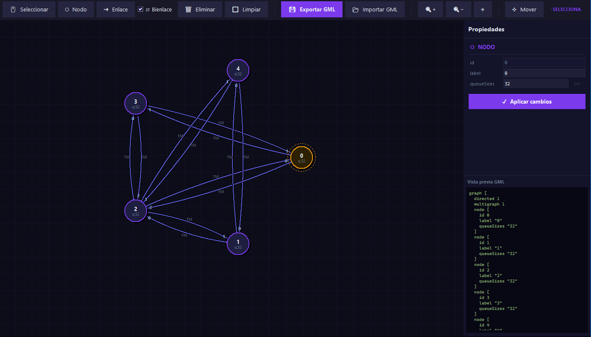
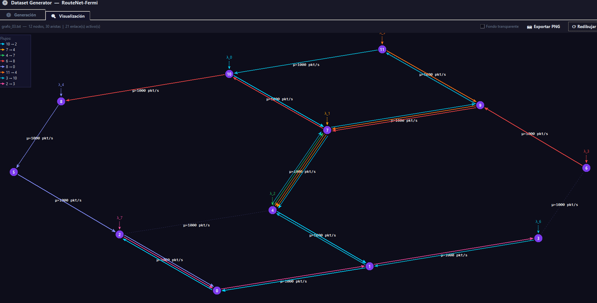
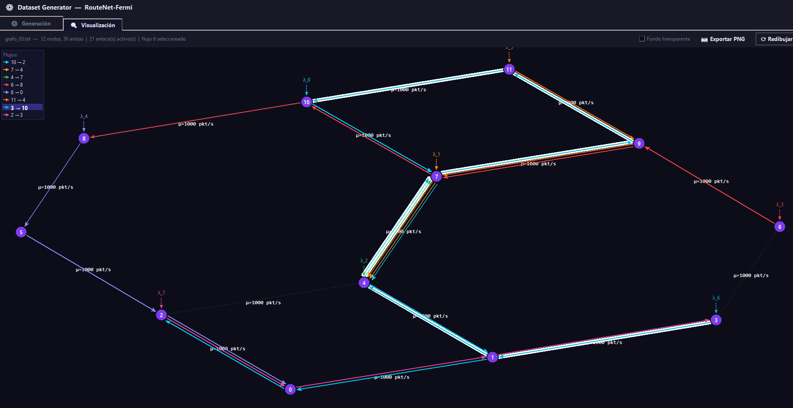
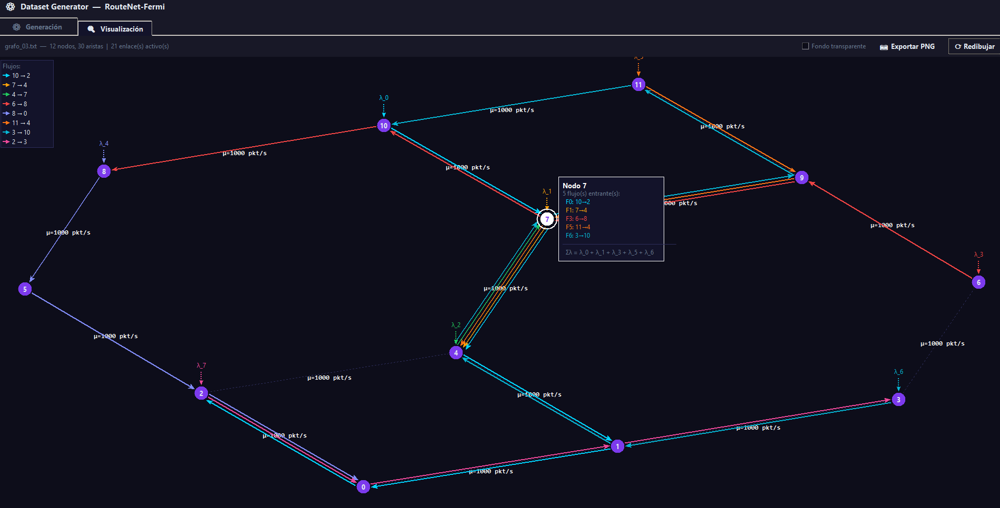
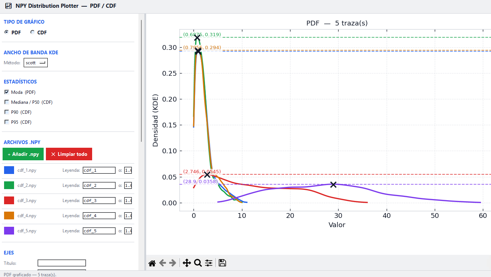
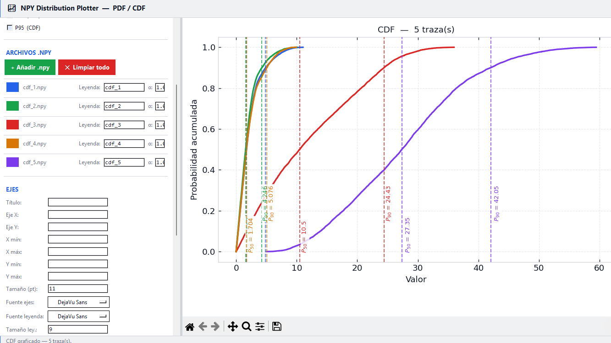
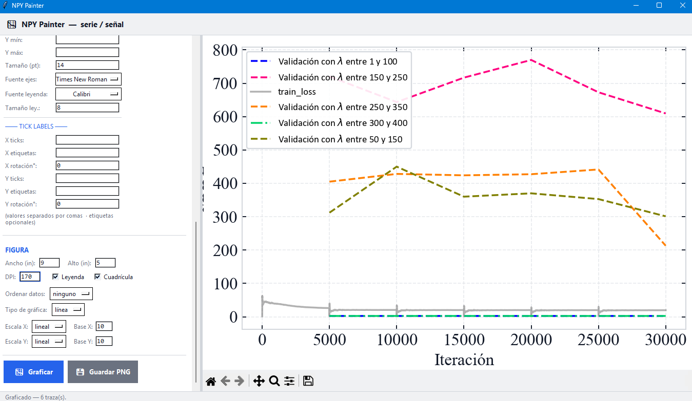
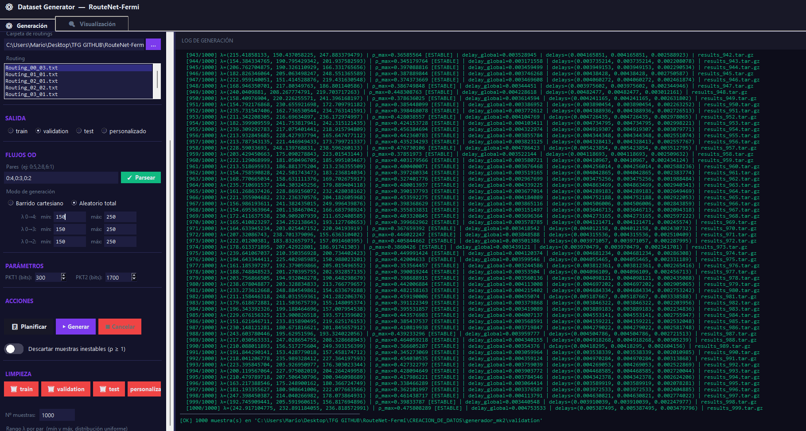

# RouteNet-Fermi M/M/1 Dataset Generator
[UNDER CONSTRUCTION]
This is a RouteNet-Fermi sample generator, which allows to generate 1 simulation each time and is designed for studying M/M/1 networks with multiple sources and destinations.

M/M/1 systems have a very interesting property: infinite queue sizes. This property is a key factor on simplifying mathematical expressions while we can get more restrictive results, which can be better rather than having exact or lower results.

RouteNet-Fermi is a brand-new way to look and work with networks. Designed by BNN team (Barcelona Neural Networking Center), from UPC (Universitat Politècnica de Catalunya) has a GitHub repository publicly available for everyone: https://github.com/BNN-UPC/RouteNet-Fermi
And the programs have been made by looking the dataset formats, publicly published in https://github.com/BNN-UPC/RouteNet-Fermi
using format v6
## Capturas de pantalla

| Editor de grafos | Vista del grafo |
|:---:|:---:|
|  |  |

| Información de flujos | Información de nodos |
|:---:|:---:|
|  |  |

| Distribución PDF | Distribución CDF |
|:---:|:---:|
|  |  |

| Visualizador NPY | Consola |
|:---:|:---:|
|  |  |

Currently, there isn't a routing matrix generator, so routing matrices are created on demand for whatever you want to analyze, either manually or with AI assistance.
